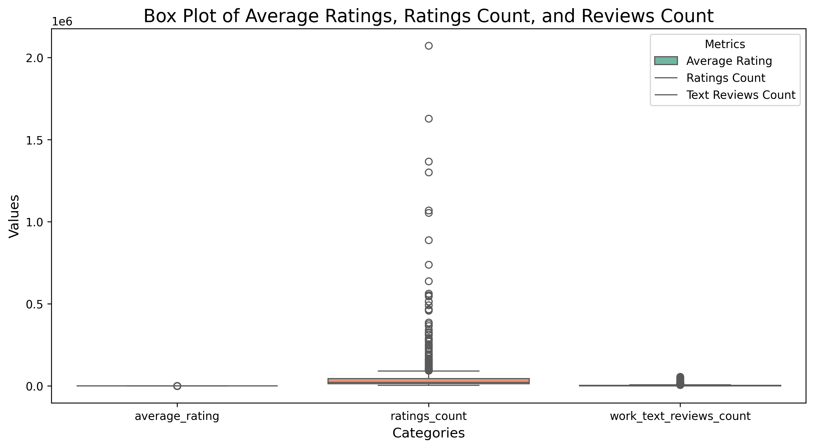
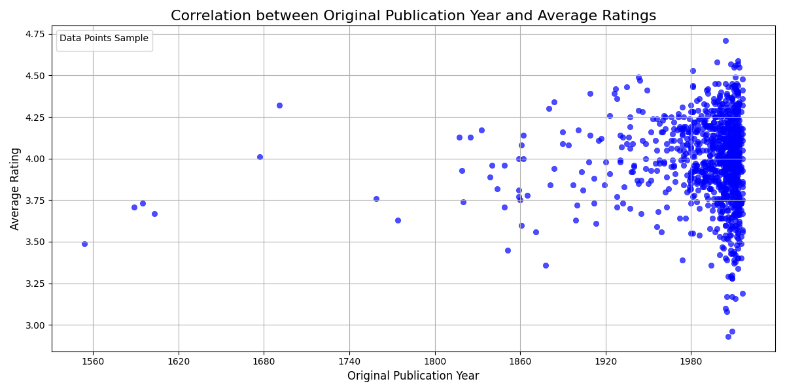
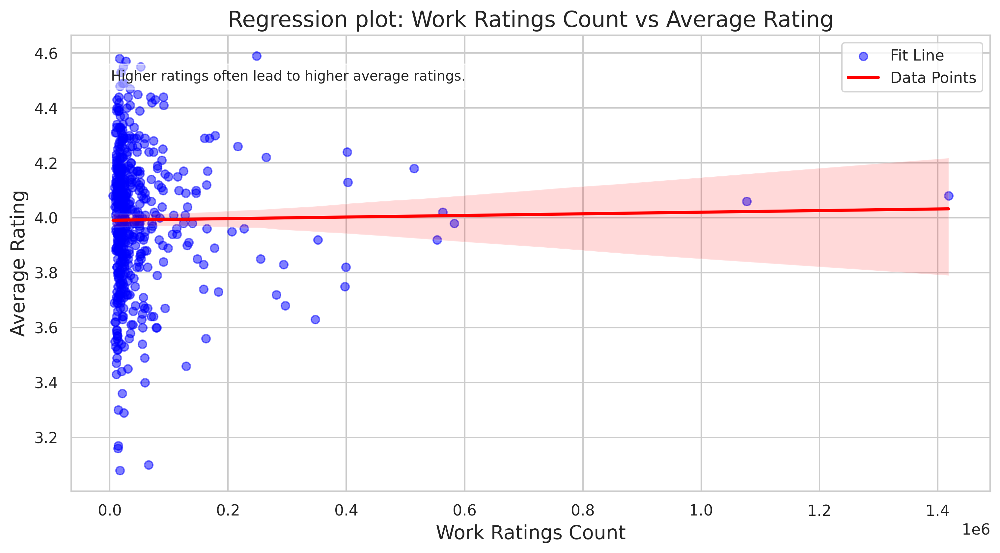
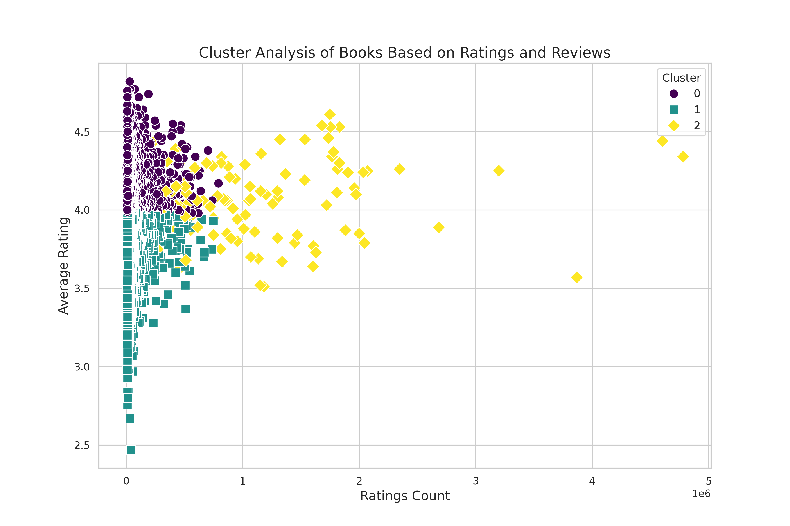
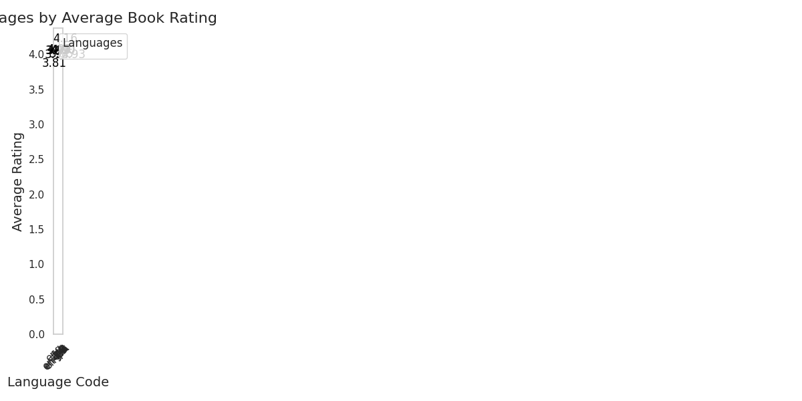

Once upon a time in the vast realm of literature, an explorer delved into a treasure trove of data dubbed *goodreads.csv*. With each row holding the potential to reveal epics of prose and poetry, this 10,000 entry dataset beckoned to be explored.

As the explorer studied the data, they found a variety of columns including book_ids, authors, publication years, and ratings. Each element told a part of the tale of how readers embraced different works. They embarked on a quest to identify outliers in average ratings, reviews, and counts.

  
*The box plot illustrates three key metrics: average rating, ratings count, and text reviews count.*

The first revelation came from a box plot showcasing three key metrics: average ratings, ratings counts, and text reviews counts. Most average ratings clustered tightly around 4.0, indicating a pool of positively received books. Yet, hidden among the data were outliers, hinting at possible fan-favorites or misclassified contributes waiting to be discovered.

Next, the explorer examined the correlation between the original publication year and the average ratings of the tomes.

  
*The graph illustrates the correlation between the original publication year and average ratings of books.*

This graph depicted a slight upward trend; books born in recent years donned higher average ratings. But in realms between the late 1960s and early 1980s, a dense cluster suggested an abundance of literary gems from that bygone era. The explorer pondered if variables beyond merely publication year might shape the tides of book popularity.

With curiosity piqued, they shifted focus to understanding the predictive powers of various features about average ratings.

  
*The graph presents a regression analysis of "Work Ratings Count" vs. "Average Rating."*

A regression analysis illuminated the interplay between work ratings count and average rating. The gentle upward trend hinted at a connection, though significant scatter revealed that while ratings count held importance, the true essence of a book’s appeal might rest in its narrative or the author's craft.

As the journey continued, the explorer plotted a course for cluster analysis, aiming to categorize books into natural groupings.

  
*The graph illustrates a cluster analysis of books, categorizing them based on average rating and ratings count.*

Three vibrant clusters emerged: 

1. **Cluster 0 (Teal)**: Books with low ratings counts but high average ratings, cherished by a few.
2. **Cluster 1 (Purple)**: Titles with widespread readership showing diverse opinions reflected in lower average ratings.
3. **Cluster 2 (Yellow)**: The stars of the show, boasting both high average ratings and ratings counts, attracting admiration from all directions.

With newfound knowledge, the explorer envisioned targeted marketing strategies to amplify the reach of underappreciated yet loved books.

Lastly, they wove a narrative exploring geographic patterns of language and average ratings.

  
*The graph illustrates the average book ratings segmented by language codes.*

This final study unveiled a rich tapestry of languages alongside their average ratings, hinting at regional tastes and preferences. Certain languages appeared to charm readers more, revealing a vibrant world of literary diversity across borders.

In the end, the explorer, equipped with insights born from their analyses, crafted a master plan to connect readers with books that resonated deeply. They resolved to share their findings far and wide, ensuring that every hidden gem found its rightful audience in the grand saga of literature.
