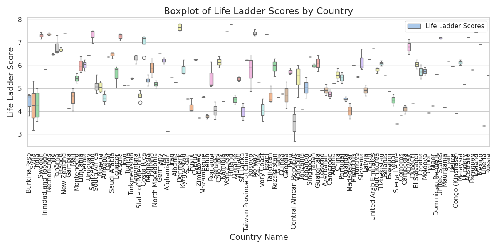
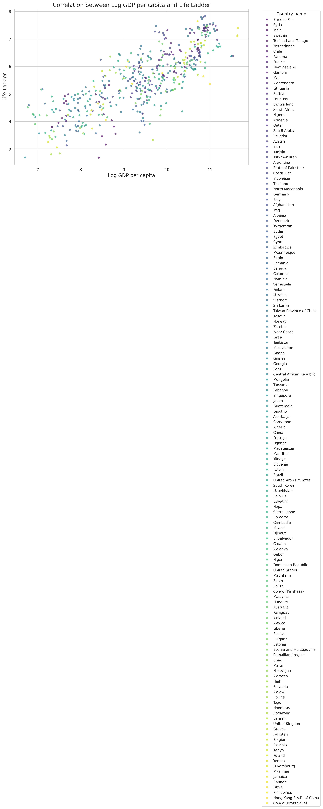
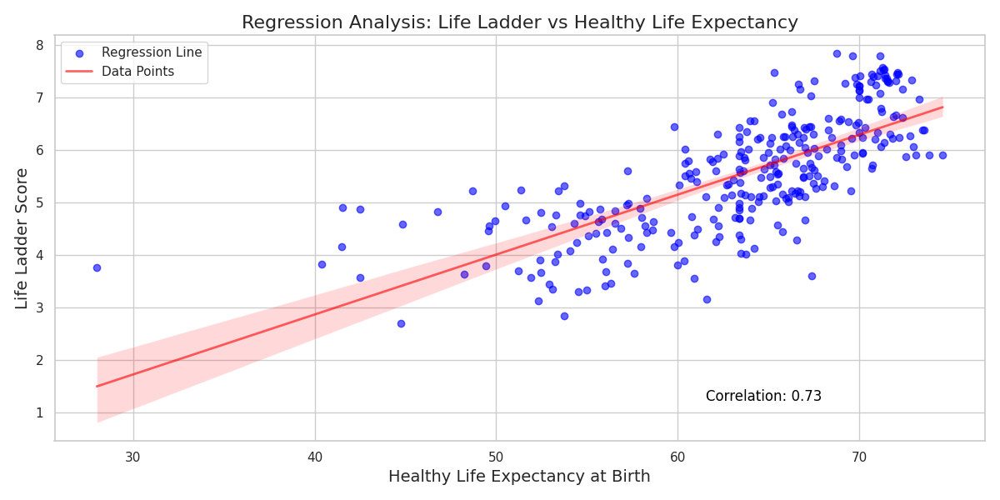
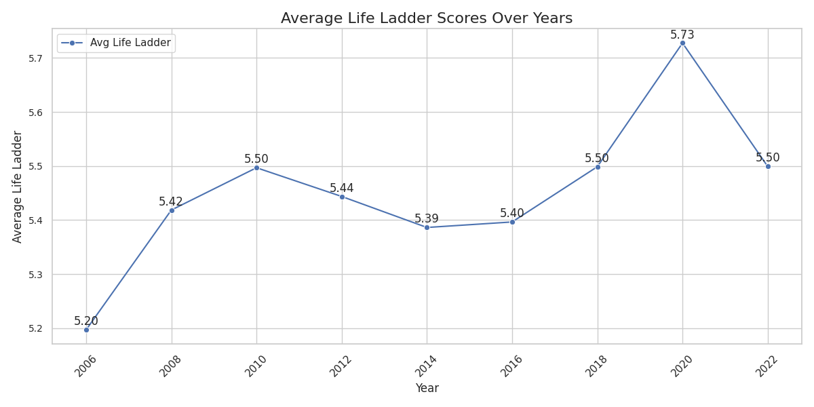
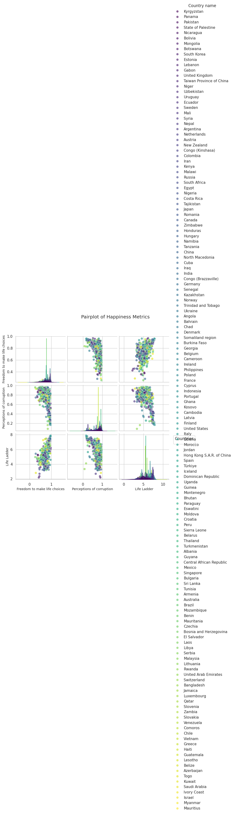

Once upon a time, in the realm of numbers and well-being, I stumbled upon a treasure trove of data captured in a simple file named **happiness.csv**. Encoded in the whispers of ISO-8859-1, this dataset held the secrets of **2363 entries** spanning the globe, detailing the life satisfaction measures of various countries through a multitude of metrics.

### Data Overview
The file revealed a myriad of columns such as **Country name**, **year**, **Life Ladder**, **Log GDP per capita**, **Social support**, and several others, each telling a part of the story of global happiness. As I delved deeper, I discovered a spread of information that spoke of both joy and struggles across nations.

### The Analysis Journey
#### Uncovering Extremes

As I embarked on my analysis, I sought to identify outliers in the **Life Ladder** scores. This quest unveiled several nations, where **Zimbabwe** and **Afghanistan** emerged from the shadows, with scores indicating profound unhappiness, whilst paradises like **Finland** and **Denmark** glittered with exceptional happiness. These insights sparked curiosity about areas needing intervention or those from which lessons could be harvested.

#### Examining Economic Ties

Next, I charted a path to explore the correlation between **Log GDP per capita** and **Life Ladder**. The scatter plot displayed a warmer relationship: as the wealth of a nation climbed, so too did the happiness of its people. But the storyline became complex, revealing countries with similar economic standings experiencing vastly different levels of joy.

#### Predicting Happiness

My journey became more revealing with regression analysis, where I pinpointed variables like **Social support** and **Healthy life expectancy** as significant predictors of happiness. The positive correlation illuminated how health and social factors wove into the fabric of a nation’s happiness.

#### Charting Time

With each passing year in the data, I created a time series to observe the **Life Ladder** scores from 2005 to 2022. Peaks and valleys told their own tale: an initial uplift, followed by gradual declines, and a surprise surge in 2020 had me pondering the impact of global events on happiness.

#### Clustering Insights

Finally, embarking on cluster analysis, I examined how **Freedom to make life choices** interacted with **Perceptions of corruption**. This led to fascinating pairings and highlighted regions ripe for targeted strategies to foster happiness.

### The Implications of Findings
From the canvas of data, a tapestry of insights emerged. The implications of these findings were profound, directing attention towards:

1. **Targeted Interventions**: Addressing needs in nations with extreme unhappiness while learning from those who excel.
2. **Further Exploration of Economics**: Encouraging policies that blend economic growth with humanity's well-being.
3. **Health Investments**: Promoting healthcare as a cornerstone for enhancing life satisfaction across borders.
4. **Adaptive Strategies**: Leveraging social metrics to craft strategies tailored to improve happiness in specific regions grappling with corruption and lack of freedoms.

Thus, through data, stories unfolded, and the journey into understanding happiness across nations continued, guiding us towards making our world a brighter place.
