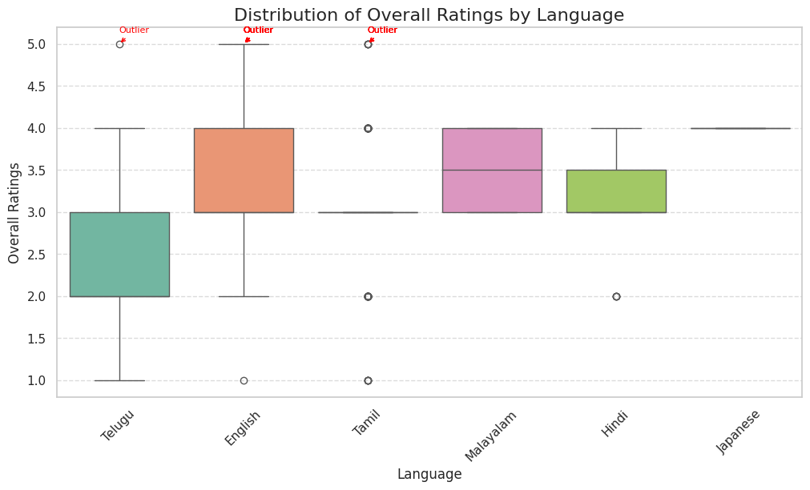
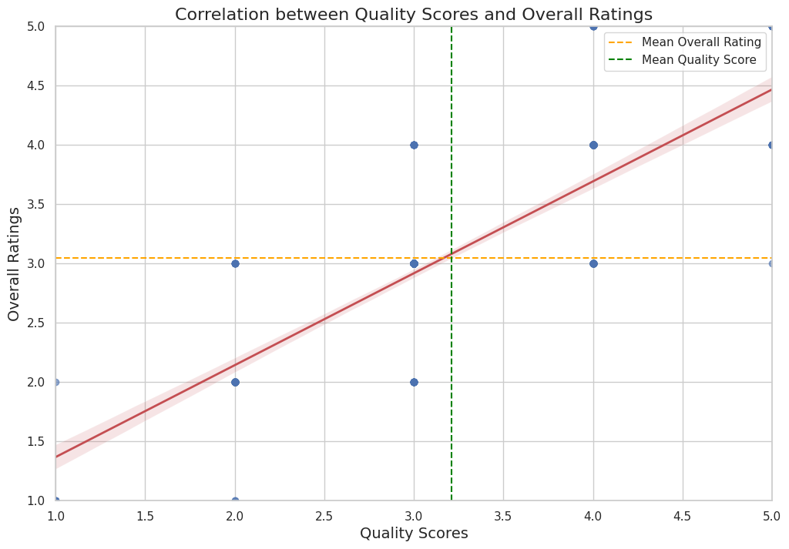
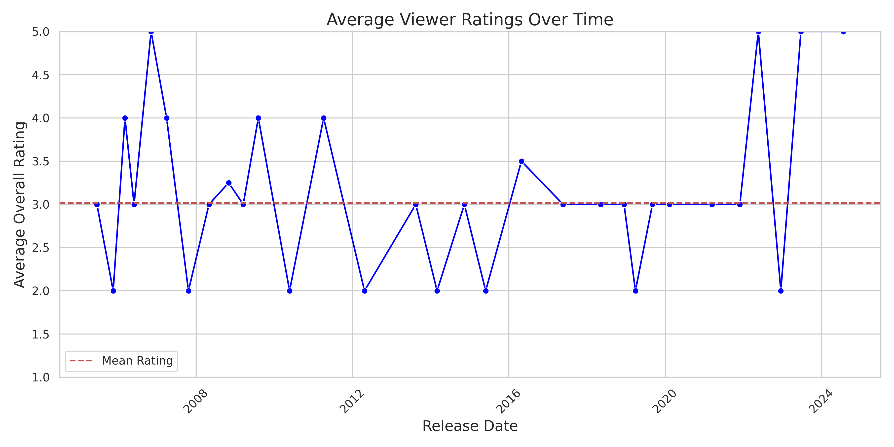
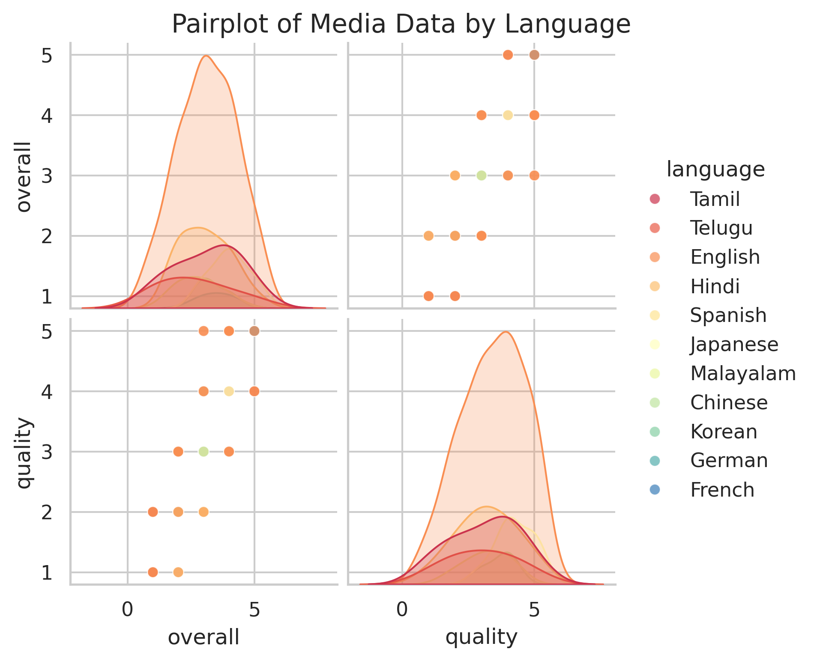
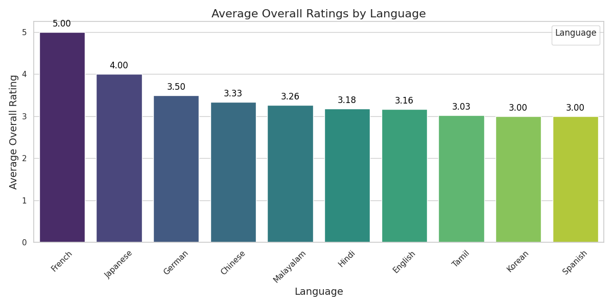

In the quiet village of Data Ville, nestled between steep mountains of information, a curious analyst discovered a treasure trove of media insights hidden within a file named `media.csv`. This file contained stories waiting to be told, rich with data regarding viewer preferences and media quality. 

The first revelation arose from examining the distribution of overall ratings segmented by language. The analyst unearthed that particular languages held exceptional tales—English and Telugu had outliers with ratings soaring to the heavens. Meanwhile, box plots beautifully illustrated that English and Tamil media were held in high regard, with median ratings around 3.5, while Hindi lingered in the shadows with lower receptions, thus portraying the glitter and gloom of viewer preferences.

The journey continued as the analyst sought to understand the relationship between quality and overall ratings. The data revealed a positive correlation; as media quality improved, so too did audience satisfaction, depicted by a robust upward trend line. This poignant discovery suggested that focusing on enhancing quality could lead to an increase in overall ratings, like a rising tide that lifts all boats.

The tale then took a temporal twist. The analyst conducted a time series analysis, plotting average viewer ratings over the years. Fluctuations danced across the graph, revealing spikes and troughs—a reflection of changing audience sentiments and content popularity from 2006 to 2014. While no clear seasonal patterns emerged, the peaks told stories of well-received content, while the valleys hinted at disappointment in less favored releases.

Then came the cluster analysis, revealing hidden segments within the data. The pairplot showcased distinct relationships between overall and quality ratings across languages. Tamil and Telugu stood proud, showcasing a high concentration of ratings that hinted at shared demographics and preferences. This discovery illuminated a path for targeted marketing strategies catering to specific audience segments, akin to a tailor crafting garments for unique body shapes.

Finally, the feature importance analysis cast a spotlight on what truly mattered in predicting overall ratings. A compelling graph revealed that French emerged as a frontrunner, boasting an average rating of 5.00, while Japanese followed close behind. English, despite its global prevalence, struggled to rise above the mediocrity of 3.16. This key insight urged producers to lean into languages that resonated deeply with audiences, ensuring their productions hit the mark and garnered the appreciation they sought.

As the analyst reflected on the findings, it became clear that these insights had profound implications. By harnessing the knowledge gleaned from viewer preferences, quality improvements, and targeted marketing strategies, media creators could better navigate the complex landscape of audience engagement. They could craft stories that not only entertained but also resonated, bridging the gap between creators and the diverse tapestry of viewers throughout Data Ville and beyond.
